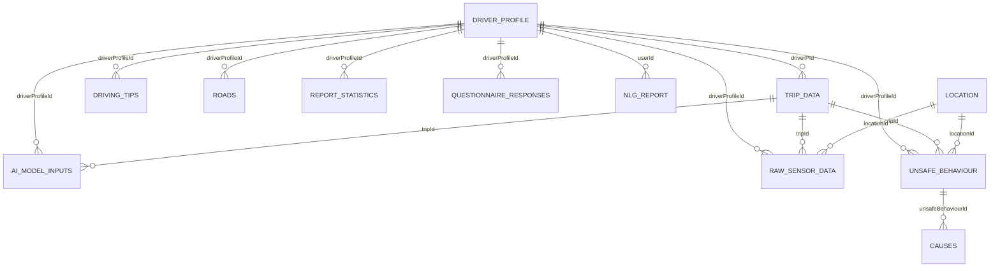

# Sdadb Database Schema Documentation

## Overview
The `Sdadb` Room database centralises persistent storage for sensor readings, unsafe driving analysis, reporting, questionnaire results, and supporting metadata used throughout the DriveAfrica application.【F:core/src/main/java/com/uoa/core/Sdadb.kt†L1-L76】 It bundles 15 entities, each exposed through DAOs for app features ranging from sensor ingestion to natural-language reports.【F:core/src/main/java/com/uoa/core/Sdadb.kt†L40-L74】

## Entity-Relationship Diagram

The optional (`o`) cardinalities reflect nullable foreign keys such as `driverPId` on trips and `locationId` on sensor or behaviour records.【F:core/src/main/java/com/uoa/core/database/entities/TripEntity.kt†L23-L34】【F:core/src/main/java/com/uoa/core/database/entities/RawSensorDataEntity.kt†L27-L48】【F:core/src/main/java/com/uoa/core/database/entities/UnsafeBehaviourEntity.kt†L10-L40】

## Entity Catalogue
The following table summarises each entity, its primary key, and core relationships.

| Table | Primary Key | Purpose | Key Relationships |
| --- | --- | --- | --- |
| `driver_profile` | `driverProfileId` (UUID) | Stores unique driver identities and sync state. | Referenced by trips, unsafe behaviours, AI inputs, raw sensor data, driving tips, roads, reports, questionnaires, and NLG reports.【F:core/src/main/java/com/uoa/core/database/entities/DriverProfileEntity.kt†L8-L18】 |
| `trip_data` | `id` (UUID) | Captures trip sessions with timing and alcohol influence flags. | Optional link to driver profile via `driverPId`; parent for AI model inputs, raw sensor data, and unsafe behaviours.【F:core/src/main/java/com/uoa/core/database/entities/TripEntity.kt†L10-L34】【F:core/src/main/java/com/uoa/core/database/entities/AIModelInputsEntity.kt†L11-L42】【F:core/src/main/java/com/uoa/core/database/entities/RawSensorDataEntity.kt†L19-L48】【F:core/src/main/java/com/uoa/core/database/entities/UnsafeBehaviourEntity.kt†L10-L40】 |
| `ai_model_inputs` | `id` (UUID) | Aggregated feature windows for model inference per trip/driver. | Child of `trip_data` and `driver_profile` through cascading foreign keys.【F:core/src/main/java/com/uoa/core/database/entities/AIModelInputsEntity.kt†L11-L42】 |
| `raw_sensor_data` | `id` (UUID) | Stores raw sensor samples plus derived metadata. | Cascades from `trip_data`, `location`, and `driver_profile` to maintain integrity of contextual data.【F:core/src/main/java/com/uoa/core/database/entities/RawSensorDataEntity.kt†L19-L48】 |
| `sensor_data` | `id` (Long, auto) | Legacy flat sensor readings for bulk ingestion. | No declared foreign keys; `tripDataId` can map to external trip references.【F:core/src/main/java/com/uoa/core/database/entities/sensorEntity.kt†L6-L34】 |
| `unsafe_behaviour` | `id` (UUID) | Records detected risky behaviours with severity and timestamps. | Linked to trip, location, and driver profile; parent of `causes` rows.【F:core/src/main/java/com/uoa/core/database/entities/UnsafeBehaviourEntity.kt†L10-L40】【F:core/src/main/java/com/uoa/core/database/entities/CauseEntity.kt†L9-L26】 |
| `causes` | `id` (UUID) | Explains contributing factors for unsafe behaviours. | Child of `unsafe_behaviour` with cascade delete on parent removal.【F:core/src/main/java/com/uoa/core/database/entities/CauseEntity.kt†L9-L26】 |
| `driving_tips` | `tipId` (UUID) | Stores personalised driving advice for drivers. | References driver profile and enforces unique tip IDs/date indexing.【F:core/src/main/java/com/uoa/core/database/entities/DrivingTipEntity.kt†L9-L33】 |
| `roads` | `id` (UUID) | Defines geofenced road segments and metadata. | Owned by a driver profile via foreign key; indexed for geo queries.【F:core/src/main/java/com/uoa/core/database/entities/RoadEntity.kt†L9-L35】 |
| `location` | `id` (UUID) | Holds GPS samples, speed, and distance metrics. | Referenced by raw sensor and unsafe behaviour records when available.【F:core/src/main/java/com/uoa/core/database/entities/LocationEntity.kt†L17-L36】【F:core/src/main/java/com/uoa/core/database/entities/RawSensorDataEntity.kt†L19-L48】【F:core/src/main/java/com/uoa/core/database/entities/UnsafeBehaviourEntity.kt†L10-L40】 |
| `nlg_report` | `id` (UUID) | Natural-language trip summaries for a driver. | Foreign key to `driver_profile` (`userId`); optional `tripId` column for cross-linking.【F:core/src/main/java/com/uoa/core/database/entities/NLGReportEntity.kt†L10-L30】 |
| `report_statistics` | `id` (UUID) | Aggregated metrics powering periodic reports. | Driver-level foreign key plus JSON columns converted via Room `Converters`.【F:core/src/main/java/com/uoa/core/database/entities/ReportStatisticsEntity.kt†L17-L67】【F:core/src/main/java/com/uoa/core/Converters.kt†L22-L123】 |
| `questionnaire_responses` | `id` (UUID) | Alcohol questionnaire submissions. | Cascades from driver profile; supports driver-level indices.【F:core/src/main/java/com/uoa/core/database/entities/QuestionnaireEntity.kt†L13-L36】 |
| `embeddings` | `chunkId` (UUID) | Text chunk embeddings for retrieval-augmented features. | Standalone table storing binary vectors and provenance metadata.【F:core/src/main/java/com/uoa/core/database/entities/EmbeddingEntity.kt†L7-L41】 |
| `fft_features` | `id` (Long, auto) | Frequency-domain features computed from sensor streams. | Standalone table without foreign keys, keyed by timestamp/label fields.【F:core/src/main/java/com/uoa/core/database/entities/FFTFeatureEntity.kt†L7-L15】 |

## Detailed Notes
- **Cascade strategies** ensure dependent analytics records are deleted when their parent driver, trip, or behaviour is removed, reducing orphaned data.【F:core/src/main/java/com/uoa/core/database/entities/AIModelInputsEntity.kt†L17-L26】【F:core/src/main/java/com/uoa/core/database/entities/RawSensorDataEntity.kt†L19-L48】【F:core/src/main/java/com/uoa/core/database/entities/UnsafeBehaviourEntity.kt†L10-L40】【F:core/src/main/java/com/uoa/core/database/entities/CauseEntity.kt†L9-L26】
- **Index coverage** spans frequently queried columns such as `tripId`, `driverProfileId`, geolocation attributes, and timestamps to accelerate filtering on time-series and driver-centric screens.【F:core/src/main/java/com/uoa/core/database/entities/AIModelInputsEntity.kt†L11-L16】【F:core/src/main/java/com/uoa/core/database/entities/RawSensorDataEntity.kt†L29-L48】【F:core/src/main/java/com/uoa/core/database/entities/RoadEntity.kt†L9-L23】
- **Type converters** serialise complex analytics outputs (lists, maps, `LocalDateTime`, durations) into JSON strings or ISO timestamps so Room can persist them transparently for `report_statistics` and related tables.【F:core/src/main/java/com/uoa/core/Converters.kt†L22-L142】【F:core/src/main/java/com/uoa/core/database/entities/ReportStatisticsEntity.kt†L17-L67】

## Usage Guidance
When adding new entities or relationships:
1. Declare the entity class and add it to the `@Database` annotation in `Sdadb` to expose it through Room.【F:core/src/main/java/com/uoa/core/Sdadb.kt†L40-L74】
2. Provide DAOs and include appropriate cascade rules and indices to maintain the integrity patterns outlined above.【F:core/src/main/java/com/uoa/core/database/entities/AIModelInputsEntity.kt†L11-L42】【F:core/src/main/java/com/uoa/core/database/entities/UnsafeBehaviourEntity.kt†L10-L40】
3. Extend `Converters` when introducing unsupported data types (e.g., new enums or collection shapes).【F:core/src/main/java/com/uoa/core/Converters.kt†L22-L142】
